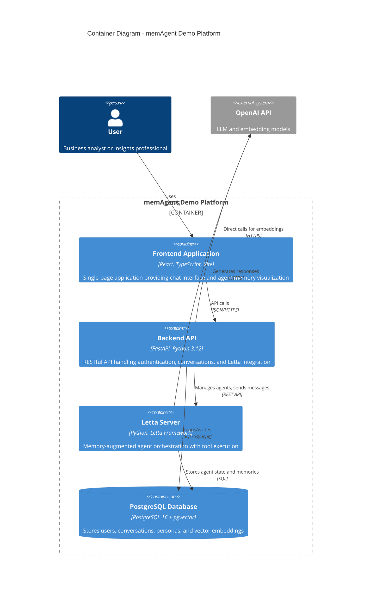

# Container Diagram (Level 2)

## Overview

The memAgent Demo platform consists of four primary containers orchestrated via Docker Compose, with data persistence and inter-container communication.



## Container Details

### Frontend Application

- **Technology**: React 19.2, TypeScript, Vite
- **Port**: 5173
- **Key Features**:
  - Authentication and session management
  - Real-time chat interface
  - Conversation history sidebar
  - Agent explorer with memory visualization (graph-based)
  - Archival memory search and display
- **State Management**: React hooks (useState, useEffect)
- **Build**: Development hot-reload via Vite dev server

### Backend API

- **Technology**: FastAPI, Python 3.12, Poetry
- **Port**: 8000
- **Key Routes**:
  - `/health` - Health check
  - `/auth/login`, `/auth/signup` - Authentication
  - `/chat/*` - Conversation and message management
  - `/letta/*` - Direct Letta operations for debugging
- **Database Access**: SQLAlchemy with asyncpg (async PostgreSQL)
- **Migration Tool**: Alembic
- **Key Services**:
  - Letta client wrapper
  - Persona service for shared memory management
  - CRUD operations for all models

### Letta Server

- **Technology**: Letta framework (self-hosted)
- **Port**: 8283
- **Purpose**: Agent orchestration, memory management, tool execution
- **Key Features**:
  - Agent lifecycle management
  - Memory blocks (core memory, archival)
  - Tool registration and execution
  - Message streaming
- **Authentication**: Password-based (LETTA_SERVER_PASSWORD)
- **Storage**: Uses shared PostgreSQL for persistence

### PostgreSQL Database

- **Version**: PostgreSQL 16 with pgvector extension
- **Port**: 5432
- **Key Schemas**:
  - **memAgent Application**: Users, conversations, messages, personas, user_persona_bridge
  - **Letta**: Agent state, memory blocks, archival memories (managed by Letta)
- **Vector Support**: pgvector extension for semantic search
- **Persistence**: Docker volume `postgres_data`

## Inter-Container Communication

### Backend → Letta

- Create agents on user registration/first message
- Send user messages to agent
- Retrieve agent state and memory
- Register tools with Letta
- Attach shared memory blocks to agents

### Backend → PostgreSQL

- User authentication and management
- Conversation and message persistence
- Persona CRUD operations
- User-persona association tracking

### Letta → PostgreSQL

- Agent state persistence
- Memory block storage and updates
- Archival memory (vector embeddings)
- Tool execution logs

### Frontend → Backend

- JWT-based authentication
- Conversation creation and retrieval
- Message sending and receiving
- Agent memory inspection

## Docker Compose Configuration

### Service Dependencies

```
postgres → (none)
letta → postgres (health check)
backend → postgres (health check), letta (health check)
frontend → backend (implicit)
```

### Health Checks

- **PostgreSQL**: pg_isready + pgvector extension verification
- **Letta**: HTTP GET on `/v1/health`
- **Backend**: No explicit health check (FastAPI /health endpoint available)

### Volumes

- `postgres_data`: Database persistence
- `letta_data`: Letta configuration and cache (mapped to `/root/.letta`)
- Local mounts for development hot-reload (backend, frontend)

## Environment Configuration

### Backend

- `DATABASE_URL`: PostgreSQL connection string
- `LETTA_BASE_URL`: Letta server endpoint
- `LETTA_SERVER_PASSWORD`: Letta authentication
- `JWT_SECRET_KEY`: JWT signing key
- `OPENAI_API_KEY`: OpenAI API access

### Letta

- `LETTA_PG_URI`: PostgreSQL connection for Letta
- `LETTA_SERVER_PASSWORD`: Server authentication
- `OPENAI_API_KEY`: OpenAI API access
