# Backend Component Diagram (Level 3)

## Overview

The backend API is structured following FastAPI best practices with clear separation between API routes, business logic, data access, and external integrations.

```mermaid
C4Component
    title Backend Component Diagram

    Container_Boundary(backend, "Backend API (FastAPI)") {
        Component(main, "Main Application", "FastAPI app", "Application entry point with CORS and router registration")
        Component(deps, "Dependencies", "FastAPI DI", "Dependency injection for auth and DB sessions")

        Component(healthAPI, "Health API", "FastAPI Router", "Health check endpoint")
        Component(authAPI, "Auth API", "FastAPI Router", "Login, signup, token generation")
        Component(chatAPI, "Chat API", "FastAPI Router", "Conversation and message management")
        Component(lettaAPI, "Letta API", "FastAPI Router", "Direct Letta operations for debugging")

        Component(userCRUD, "User CRUD", "SQLAlchemy queries", "User database operations")
        Component(conversationCRUD, "Conversation CRUD", "SQLAlchemy queries", "Conversation operations")
        Component(messageCRUD, "Message CRUD", "SQLAlchemy queries", "Message operations")
        Component(personaCRUD, "Persona CRUD", "SQLAlchemy queries", "Persona operations")

        Component(personaService, "Persona Service", "Business logic", "Shared memory block management and attachment")

        Component(config, "Configuration", "Pydantic Settings", "Environment-based configuration")
        Component(lettaClient, "Letta Client", "Letta SDK wrapper", "Agent creation, messaging, tool registration")
        Component(security, "Security", "JWT utilities", "Password hashing and JWT operations")
        Component(piAgentConfig, "Pi Agent Config", "JSON config", "Agent system prompt and memory structure")

        Component(userModel, "User", "SQLAlchemy model", "id, email, display_name, letta_agent_id, hashed_password")
        Component(conversationModel, "Conversation", "SQLAlchemy model", "id, user_id, title, timestamps")
        Component(messageModel, "Message", "SQLAlchemy model", "id, conversation_id, role, content, timestamp")
        Component(personaModel, "Persona", "SQLAlchemy model", "id, persona_handle, industry, role, description, KPIs")
        Component(bridgeModel, "UserPersonaBridge", "SQLAlchemy model", "user_id, persona_id, confidence_score")
    }

    Container_Boundary(tools, "Agent Tools Package") {
        Component(placerTools, "Placer Tools", "Python functions", "search_places, get_place_summary, compare_performance, etc.")
        Component(personaTools, "Persona Tools", "Python functions", "list_available_personas, update_user_persona_profile_in_db")
        Component(repository, "Data Repository", "Mock data", "In-memory POI and analytics data")
    }

    ContainerDb(postgres, "PostgreSQL", "Database")
    Container(letta, "Letta Server", "Agent orchestration")

    Rel(main, healthAPI, "includes")
    Rel(main, authAPI, "includes")
    Rel(main, chatAPI, "includes")
    Rel(main, lettaAPI, "includes")

    Rel(authAPI, deps, "uses")
    Rel(chatAPI, deps, "uses")
    Rel(lettaAPI, deps, "uses")

    Rel(authAPI, userCRUD, "calls")
    Rel(chatAPI, conversationCRUD, "calls")
    Rel(chatAPI, messageCRUD, "calls")
    Rel(chatAPI, personaService, "calls")
    Rel(chatAPI, lettaClient, "manages agents")
    Rel(lettaAPI, lettaClient, "manages agents")

    Rel(userCRUD, userModel, "queries")
    Rel(conversationCRUD, conversationModel, "queries")
    Rel(messageCRUD, messageModel, "queries")
    Rel(personaCRUD, personaModel, "queries")
    Rel(personaCRUD, bridgeModel, "queries")

    Rel(personaService, personaCRUD, "reads data")
    Rel(personaService, lettaClient, "manages memory blocks")

    Rel(lettaClient, piAgentConfig, "loads")
    Rel(lettaClient, placerTools, "registers")
    Rel(lettaClient, personaTools, "registers")

    Rel(userModel, postgres, "persists to")
    Rel(conversationModel, postgres, "persists to")
    Rel(messageModel, postgres, "persists to")
    Rel(personaModel, postgres, "persists to")
    Rel(bridgeModel, postgres, "persists to")

    Rel(lettaClient, letta, "HTTP calls")
    Rel(personaTools, postgres, "direct async access")
    Rel(placerTools, repository, "queries")
```



## API Layer Details

### Health API (`/health`)

- **Purpose**: Service health monitoring
- **Endpoints**:
  - `GET /health` - Returns status
- **Dependencies**: None
- **Response**: Simple status message

### Auth API (`/auth`)

- **Purpose**: User authentication and registration
- **Endpoints**:
  - `POST /auth/login` - Username/password authentication
  - `POST /auth/signup` - New user registration
- **Key Operations**:
  - Password hashing (bcrypt)
  - JWT token generation
  - User validation
- **Response**: JWT access token and user details

### Chat API (`/chat`)

- **Purpose**: Conversation and message management with agent integration
- **Endpoints**:
  - `POST /chat/messages` - Legacy endpoint (simple echo)
  - `POST /chat/conversations` - Create new conversation
  - `GET /chat/conversations` - List user conversations
  - `GET /chat/conversations/{id}/messages` - Get conversation messages
  - `POST /chat/conversations/{id}/messages` - Send message to agent
- **Key Operations**:
  - Agent lazy initialization (creates on first message if needed)
  - Message persistence
  - Conversation title auto-generation (from first message)
  - Letta agent interaction
- **Dependencies**:
  - Requires authentication (JWT)
  - Creates Letta agent if user.letta_agent_id is None

### Letta API (`/letta`)

- **Purpose**: Direct Letta operations for debugging and administration
- **Endpoints**:
  - `POST /letta/agents` - Create agent
  - `POST /letta/agents/{id}/messages` - Send message directly
  - `GET /letta/agents` - List all agents
  - `GET /letta/agents/{id}/memory` - Inspect agent memory
  - `GET /letta/agents/{id}/archival` - Query archival memory
- **Use Case**: Frontend agent explorer, debugging, admin operations

## CRUD Layer

### Patterns

All CRUD modules follow similar patterns:

- Async functions using AsyncSession
- Type hints for all parameters and returns
- Single responsibility per function
- Error handling for not found cases

### User CRUD

- `create_user()` - Create with hashed password
- `get_user_by_email()` - Authentication lookup
- `get_user_by_id()` - Session restoration
- `update_user_letta_agent_id()` - Associate agent with user

### Conversation CRUD

- `create_conversation()` - Initialize empty conversation
- `get_user_conversations()` - List with ordering (newest first)
- `get_conversation_by_id()` - Single conversation with ownership check
- `update_conversation_title()` - Auto-title generation

### Message CRUD

- `create_message()` - Add to conversation
- `get_conversation_messages()` - Chronological list
- `get_message_count()` - For title generation trigger

### Persona CRUD

- `list_all_personas()` - Discovery for tools
- `get_persona_by_handle()` - Lookup by string identifier
- `assign_persona_to_user()` - Create bridge record with confidence score

## Service Layer

### Persona Service

The most complex business logic in the system, managing shared memory across agents.

**Key Functions**:

1. **`get_or_create_persona_shared_block()`**

   - Thread-safe creation using per-persona locks
   - Searches across all agents for existing blocks
   - Creates and attaches if not found
   - Handles race conditions
   - Block label format: `{persona_handle}_service_experience`

2. **`attach_persona_blocks_to_agents_of_users_with_persona_handle()`**
   - Finds all users with a persona
   - Gets/creates shared block using first agent
   - Attaches to all remaining agents
   - Idempotent (safe to call multiple times)

**Locking Strategy**:

- Per-persona locks prevent concurrent block creation
- Dictionary of asyncio.Lock objects keyed by persona_handle
- Critical for maintaining single shared block per persona

## Core Components

### Configuration

- Pydantic Settings with .env file support
- Cached with `@lru_cache` decorator
- Key settings:
  - Database URL
  - JWT secret
  - Letta connection details
  - Persona seed password

### Letta Client

**Functions**:

- `create_letta_client()` - Initialize with timeout
- `create_pi_agent()` - Create from .af configuration
- `create_simple_agent()` - Simplified agent creation
- `register_mock_tools()` - Register tool functions with Letta
- `send_message_to_agent()` - Message handling with response extraction

**Pi Agent Configuration**:

- Loaded from `pi_agent_base.af` JSON file
- Defines 3 core memory blocks:
  1. `agent_persona` - Agent identity (read-only)
  2. `human` - Personal user facts
  3. `user_persona_profile` - Professional role/industry (triggers shared memory)
- System prompt with Pi personality
- LLM config (GPT-4o) and embedding config

### Security

- Password hashing: bcrypt via passlib
- JWT generation: python-jose with HS256
- Token expiration: Configurable (default 60 minutes)

## Database Models

### Relationships

```
User 1---* Conversation
Conversation 1---* Message
User *---* Persona (through UserPersonaBridge)
```

### Key Fields

- **User.letta_agent_id**: Links to Letta agent (nullable, created on first interaction)
- **Message.role**: Enum (USER, SYSTEM, AGENT)
- **UserPersonaBridge.confidence_score**: Float 0.0-1.0 (how certain the persona match is)
- **Persona.persona_handle**: Unique identifier following `<industry>_<professional_role>` format

### Timestamps

All models have:

- `created_at`: Immutable timestamp
- `updated_at`: Auto-updating on modification (where applicable)

## Agent Tools Package

### Placer Tools

8 main functions simulating Placer.ai API:

1. **search_places()** - POI discovery with geo filters
2. **get_place_summary()** - Visit metrics and trends
3. **compare_performance()** - Multi-entity ranking
4. **get_trade_area_profile()** - Geographic catchment
5. **get_audience_profile()** - Demographics and psychographics
6. **get_visit_flows()** - Before/after journey patterns
7. Additional utilities for geo operations

**Data Format**: JSON string returns (Letta tools must return strings)

### Persona Tools

2 functions for persona system:

1. **list_available_personas()** - Discovery tool
2. **update_user_persona_profile_in_db()** - Association and memory attachment
   - Validates persona existence or creates new
   - Calls persona service to attach blocks
   - Uses nest_asyncio for sync/async bridging

### Data Repository

- In-memory mock data store
- Simulates POI catalog, visit data, demographics
- Supports filtering, aggregation, time-series
- Future: Replace with real Placer.ai API calls

## Request Flow Examples

### User Login

```
POST /auth/login
→ authAPI.login()
→ userCRUD.get_user_by_email()
→ security.verify_password()
→ security.create_access_token()
← JWT token + user data
```

### Send Message (First Time)

```
POST /chat/conversations/{id}/messages
→ chatAPI.send_message_to_conversation()
→ Check user.letta_agent_id (None)
→ lettaClient.create_pi_agent()
→ userCRUD.update_user_letta_agent_id()
→ lettaClient.send_message_to_agent()
→ messageCRUD.create_message() (x2: user + agent)
→ conversationCRUD.update_conversation_title()
← user_message + assistant_message
```

### Persona Association (via Tool)

```
Agent calls update_user_persona_profile_in_db()
→ personaCRUD.get_persona_by_handle()
→ personaCRUD.assign_persona_to_user()
→ personaService.attach_persona_blocks_to_agents_of_users_with_persona_handle()
  → personaService.get_or_create_persona_shared_block()
  → For each user: letta.agents.blocks.attach()
← Success confirmation
```

## Error Handling

### HTTP Exceptions

- 401 Unauthorized: Invalid credentials or missing token
- 404 Not Found: Conversation or resource doesn't exist
- 500 Internal Server Error: Unexpected failures

### Logging

- Structured logging with Python logging module
- Error level for exceptions
- Debug level for tool execution and block management
- Warning level for non-critical issues

## Database Sessions

### Pattern

```python
async with session_factory() as session:
    # operations
    await session.commit()
```

### Dependency Injection

```python
def get_session() -> AsyncSession:
    # Yields session, ensures cleanup
```

### Transaction Management

- Auto-commit on normal completion
- Auto-rollback on exception
- Connection pooling via SQLAlchemy async engine
