# Agent Architecture Diagram

## Overview

The agent architecture centers on Letta's memory-augmented framework, custom tools for location analytics, and the Pi agent configuration that defines behavior and memory structure.

```mermaid
graph TB
    subgraph "Agent Ecosystem"
        subgraph "Pi Agent Instance"
            AgentCore[Agent Core<br/>Letta Framework]

            subgraph "Core Memory Blocks"
                AgentPersona[agent_persona<br/>Read-Only<br/>2000 chars]
                Human[human<br/>Personal Facts<br/>3000 chars]
                UserPersona[user_persona_profile<br/>Professional Context<br/>5000 chars]
            end

            subgraph "Shared Memory Blocks"
                SharedBlock1[persona_service_experience<br/>Shared across users<br/>8000 chars]
            end

            ArchivalMemory[(Archival Memory<br/>Vector DB<br/>Long-term storage)]
        end

        subgraph "Tool Ecosystem"
            subgraph "Placer.ai Tools"
                SearchPlaces[search_places<br/>POI discovery]
                PlaceSummary[get_place_summary<br/>Visit metrics]
                ComparePerf[compare_performance<br/>Rankings]
                TradeArea[get_trade_area_profile<br/>Catchment]
                Audience[get_audience_profile<br/>Demographics]
                VisitFlows[get_visit_flows<br/>Journeys]
            end

            subgraph "Persona Tools"
                ListPersonas[list_available_personas<br/>Discovery]
                UpdatePersona[update_user_persona_profile_in_db<br/>Association + Memory]
            end

            DataRepo[Data Repository<br/>Mock POI Data]
        end

        LLM[OpenAI GPT-4o<br/>Language Model]
        Embeddings[text-embedding-3-small<br/>Vector Embeddings]
    end

    subgraph "Backend Integration"
        LettaClient[Letta Client Wrapper]
        PersonaService[Persona Service<br/>Block Management]
        Database[(PostgreSQL<br/>User, Persona,<br/>Conversation Data)]
    end

    User([User]) --> |Sends message| LettaClient
    LettaClient --> |create_pi_agent| AgentCore
    LettaClient --> |send_message| AgentCore

    AgentCore --> |Reads/Writes| AgentPersona
    AgentCore --> |Reads/Writes| Human
    AgentCore --> |Reads/Writes| UserPersona
    AgentCore --> |Reads/Writes| SharedBlock1
    AgentCore --> |Stores passages| ArchivalMemory

    AgentCore --> |Calls tool| SearchPlaces
    AgentCore --> |Calls tool| PlaceSummary
    AgentCore --> |Calls tool| ComparePerf
    AgentCore --> |Calls tool| TradeArea
    AgentCore --> |Calls tool| Audience
    AgentCore --> |Calls tool| VisitFlows
    AgentCore --> |Calls tool| ListPersonas
    AgentCore --> |Calls tool| UpdatePersona

    SearchPlaces --> DataRepo
    PlaceSummary --> DataRepo
    ComparePerf --> DataRepo
    TradeArea --> DataRepo
    Audience --> DataRepo
    VisitFlows --> DataRepo

    UpdatePersona --> |Queries/Updates| Database
    UpdatePersona --> |Attaches blocks| PersonaService
    PersonaService --> |get_or_create_persona_shared_block| LettaClient

    AgentCore --> |Reasoning| LLM
    AgentCore --> |Embeds passages| Embeddings

    ArchivalMemory --> |Similarity search| Embeddings

    style AgentPersona fill:#9b59b6,color:#fff
    style Human fill:#3498db,color:#fff
    style UserPersona fill:#2ecc71,color:#fff
    style SharedBlock1 fill:#e67e22,color:#fff
```



## Agent Lifecycle

### 1. Agent Creation

**Trigger**: User sends first message (lazy initialization)

**Process**:

```python
# In backend/app/api/chat.py
if not current_user.letta_agent_id:
    letta_client = create_letta_client(base_url, token)
    agent_id = create_pi_agent(
        client=letta_client,
        user_display_name=current_user.display_name,
        initial_user_persona_info=""
    )
    await update_user_letta_agent_id(session, current_user.id, agent_id)
```

**Configuration Source**: `backend/app/core/pi_agent_base.af`

- .af file defining agent template
- System prompt (Pi's personality and instructions)
- Memory block definitions
- LLM and embedding configuration

### 2. Agent Initialization

**Memory Blocks Created**:

1. **agent_persona** (Read-Only)

   ```
   Pi is an expert location analytics assistant for Placer.ai
   specialized in analyzing foot traffic, visitor patterns,
   and location performance using Placer's location intelligence data.
   ```

2. **human** (Writable)

   ```
   User name: {display_name}
   Personal facts about the user to be discovered through interaction.
   ```

3. **user_persona_profile** (Writable, Triggers Shared Memory)
   ```
   Cannot yet determine a persona for this user.
   Professional role and industry to be discovered through interaction.
   ```

**Tools Registered**: All Placer and Persona tools are available immediately

### 3. Message Handling

**Flow**:

```
User message → Backend API → Letta Client → Agent Core
    ↓
Agent processes:
    1. Reads relevant memory blocks
    2. Retrieves from archival if needed
    3. Calls tools as necessary
    4. Reasons with LLM
    5. Updates memory blocks
    6. Generates response
    ↓
Response → Backend API → Frontend → User
```

### 4. Tool Execution

**Registration**:

```python
# Backend registers Python functions with Letta
registered_tools = register_mock_tools(client)
# Returns: ['search_places', 'get_place_summary', ...]
```

**Execution**:

- Agent decides to call tool based on user query
- Letta executes function and returns result as string
- Agent incorporates result into reasoning
- May call multiple tools in sequence

**Tool Output Format**: Always JSON strings

```python
return json.dumps({"places": [...], "error": None})
```

## Tool Ecosystem

### Placer.ai Tools (8 Functions)

#### 1. search_places

**Purpose**: Foundational POI discovery
**Parameters**:

- `geo_filter_type`: point_radius | bounding_box | polygon | metro
- `geo_config`: JSON geography specification
- `category_ids`, `chain_ids`, `text_query`: Filters
- `min_visits`, `limit`: Thresholds

**Use Cases**:

- "Find all regional malls in Atlanta"
- "Show me Chick-fil-A locations within 10km of downtown"
- "List golf courses in the bay area"

**Return**: Array of POI objects with basic metadata

#### 2. get_place_summary

**Purpose**: Health snapshot and performance metrics
**Parameters**:

- `place_ids`: Comma-separated IDs
- `time_range_start/end`: Date range
- `granularity`: daily | weekly | monthly
- `include_benchmark`, `include_rollup`: Optional aggregations

**Use Cases**:

- "How is Garden State Plaza performing?"
- "Compare visits at these 3 stores over Q1"
- "Show me monthly trends for this center"

**Return**: Visit counts, trends, dwell time, frequency

#### 3. compare_performance

**Purpose**: Multi-entity ranking and classification
**Parameters**:

- `entities`: JSON array of {type, id} objects
- `time_range_start/end`: Date range
- `metric`: visits | visit_frequency | dwell_time

**Use Cases**:

- "Rank my portfolio by visit growth"
- "Which stores are top performers?"
- "Compare these 5 candidate sites"

**Return**: Time series + rankings with YoY changes

#### 4. get_trade_area_profile

**Purpose**: Geographic catchment analysis
**Parameters**:

- `place_ids`: Target locations
- `time_range_start/end`: Date range
- `output_geography`: block_group | census_tract | zip | cbg

**Use Cases**:

- "Where do visitors to this mall come from?"
- "What's the trade area for this outlet?"
- "Cannibalization risk analysis"

**Return**: Geographic units with visit share, demographics

#### 5. get_audience_profile

**Purpose**: Demographics and psychographics
**Parameters**:

- `base_entities`: JSON array of entities
- `time_range_start/end`: Date range
- `dimensions`: age,income,household_size,kids,lifestyle

**Use Cases**:

- "Who visits this brand?"
- "Audience fit for this tenant mix"
- "Compare customer profiles"

**Return**: Distribution breakdowns by dimension

#### 6. get_visit_flows

**Purpose**: Before/after journey patterns
**Parameters**:

- `origin_place_ids`: Starting points
- `time_range_start/end`: Date range
- `window_before_minutes`, `window_after_minutes`: Time windows
- `group_by`: destination_place | destination_chain | destination_category

**Use Cases**:

- "Where do people go after playing golf?"
- "Cross-shopping between these brands"
- "Co-tenancy opportunities"

**Return**: Flow destinations with visit counts and timing

### Persona Tools (2 Functions)

#### 1. list_available_personas

**Purpose**: Discovery of existing persona taxonomy
**Parameters**: None
**Return**:

```json
{
  "personas": [
    {
      "persona_handle": "qsr_real_estate",
      "industry": "QSR",
      "professional_role": "Real Estate",
      "description": "...",
      "typical_kpis": "...",
      "typical_motivations": "..."
    }
  ],
  "taxonomy_format": "<industry>_<professional_role>",
  "examples": ["qsr_real_estate", "tobacco_consumer_insights"]
}
```

**Use Case**: Agent calls before attempting persona association

#### 2. update_user_persona_profile_in_db

**Purpose**: Associate user with persona and attach shared memory
**Parameters**:

- `user_id`: User UUID
- `persona_handle`: Format `<industry>_<professional_role>`
- `confidence_score`: 0.0-1.0 (default 1.0)

**Critical Sequence**:

1. Validates user exists
2. Looks up or creates persona
3. Creates UserPersonaBridge record
4. Calls `attach_persona_blocks_to_agents_of_users_with_persona_handle()`
   - Gets or creates shared block
   - Attaches to all relevant agents
5. Returns success confirmation

**Return**:

```json
{
  "success": true,
  "persona_handle": "qsr_real_estate",
  "industry": "QSR",
  "professional_role": "Real Estate",
  "confidence_score": 1.0,
  "message": "User associated with persona and shared memory blocks attached"
}
```

**Agent Instructions** (from system prompt):

> Before updating this block, you MUST call update_user_persona_profile_in_db()
> with the persona_handle you've identified to ensure proper database association
> and shared memory attachment.

### Data Repository (Mock)

**Purpose**: Simulate Placer.ai API responses
**Implementation**: In-memory Python dictionaries
**Data Types**:

- POI catalog (50+ mock locations)
- Visit time series
- Demographics
- Trade areas
- Flow patterns

**Future**: Replace with real Placer.ai API client

## Agent Reasoning Flow

### Typical Multi-Step Query

**Example**: "Find QSR restaurants in Atlanta with high foot traffic and show me their audience profile"

**Agent Reasoning**:

```
1. Parse user intent:
   - Geography: Atlanta
   - Category: QSR
   - Requirement: High foot traffic
   - Analysis: Audience profile

2. Call search_places:
   - geo_filter_type: "metro"
   - geo_config: {"name": "atlanta"}
   - category_ids: "qsr"
   - min_visits: 500000

3. Receive 10 candidate POIs

4. Call get_place_summary:
   - place_ids: "poi_123,poi_456,poi_789"
   - Filter to top 5 by visits

5. Call get_audience_profile:
   - base_entities: [{type: "place", id: "poi_123"}, ...]
   - dimensions: "age,income,household_size"

6. Synthesize response:
   - Present top locations
   - Highlight audience characteristics
   - Note any patterns
   - Suggest next steps

7. Store key insights in archival memory
8. Update human/persona blocks if new info learned
```

## LLM Configuration

### Model Settings (from pi_agent_base.af)

```json
{
  "model": "openai/gpt-4o",
  "model_endpoint_type": "openai",
  "context_window": 128000,
  "temperature": 0.7,
  "max_tokens": 16384
}
```

### Embedding Settings

```json
{
  "embedding_endpoint_type": "openai",
  "embedding_model": "text-embedding-3-small",
  "embedding_dim": 1536,
  "embedding_chunk_size": 300
}
```

## System Prompt Structure

### Identity

> You are Pi, an expert location analytics assistant for Placer.ai.

### Capabilities

- Finding and comparing locations
- Analyzing visitor demographics and trade areas
- Benchmarking performance
- Understanding customer journeys
- Site selection and portfolio insights

### Memory Management Instructions

- Detailed guidance on what to store in each block
- Warnings about PII in shared blocks
- Required tool calls before persona updates

### Communication Style

- Concise and professional
- Lead with actionable insights
- Precise terminology
- Transparent about data limitations

### Analytical Workflow

1. Confirm understanding
2. Execute analysis with tools
3. Present key findings first
4. Provide supporting data
5. Suggest logical next steps

## Error Handling and Fallbacks

### Tool Failures

- Tools return error objects in JSON
- Agent acknowledges and suggests alternatives
- Logs help with debugging

### Memory Conflicts

- Locking prevents race conditions in persona block creation
- Idempotent attachment (safe to call multiple times)
- Validation before persona association

### API Limits

- Context window management (128K tokens)
- Memory block size limits enforced
- Archival memory prevents token overflow

## Performance Considerations

### Memory Block Efficiency

- Small core memory (total ~18K chars max)
- Shared blocks reduce duplication
- Archival for unlimited long-term storage

### Tool Call Optimization

- Agent learns to batch related queries
- Filters applied early to reduce data volume
- Caching in mock data repository

### Concurrency

- Multiple agents can run simultaneously
- Per-persona locks for block creation
- Database connection pooling

## Memory Architecture - More Details in Memory Architecture Doc

### Core Memory Types

#### 1. Agent Persona (Read-Only)

- **Purpose**: Define agent identity and capabilities
- **Modification**: Never modified by agent
- **Content**: Pi's role, communication style, capabilities
- **Size**: 2000 characters

#### 2. Human Block (Personal)

- **Purpose**: Store individual user facts
- **Scope**: Private to each user
- **Content**:
  - User's name
  - Personal preferences
  - Conversation habits
  - Non-professional information
- **Size**: 3000 characters

#### 3. User Persona Profile (Hybrid)

- **Purpose**: Professional context and role identification
- **Scope**: Private block, triggers shared block attachment
- **Content**:
  - Industry (e.g., QSR, Retail, Tobacco)
  - Professional role (e.g., Real Estate, Asset Management)
  - Typical KPIs
  - Analytical patterns
- **Important**: NO PII or specific POI details (those go in archival)
- **Size**: 5000 characters

**Update Workflow**:

```
Agent identifies user persona through conversation
    ↓
MUST call update_user_persona_profile_in_db(user_id, persona_handle)
    ↓
Creates/updates UserPersonaBridge in database
    ↓
Attaches shared memory block to agent
    ↓
Agent updates user_persona_profile block with persona details
```

#### 4. Shared Persona Blocks (Collaborative)

- **Label Format**: `{persona_handle}_service_experience`
  - Example: `qsr_real_estate_service_experience`
- **Purpose**: Cross-user learning for similar personas
- **Scope**: Shared across all users with same persona
- **Content**:
  - Common analytical patterns
  - Typical query flows
  - Effective approaches for this persona type
  - **NOT ALLOWED**: Specific user PII, proprietary insights, POI names
- **Size**: 8000 characters
- **Lifecycle**: Created on first association, persists indefinitely

**Block Sharing Mechanism**:

```
User A (qsr_real_estate) ─────┐
                               ├──► qsr_real_estate_service_experience
User B (qsr_real_estate) ─────┘     (Single shared block)

User C (tobacco_consumer_insights) ──► tobacco_consumer_insights_service_experience
                                        (Different shared block)
```

### Archival Memory

- **Storage**: PostgreSQL with pgvector
- **Indexing**: Vector embeddings (text-embedding-3-small)
- **Content**:
  - Long conversation passages
  - Detailed analytical insights
  - Specific POI information
  - Query-response pairs
- **Retrieval**: Semantic similarity search
- **Lifecycle**: Automatically populated by Letta during conversations

## Future Enhancements

### Agent Capabilities

- Streaming responses for real-time feedback
- Multi-agent collaboration (e.g., specialist agents)
- Custom tools per user/organization
- Fine-tuned models for location analytics

### Memory Improvements

- Hierarchical memory (team → organization → global)
- Memory consolidation algorithms
- Automatic persona confidence scoring
- Time-based memory decay

### Tool Ecosystem

- Real Placer.ai API integration
- Additional data sources (weather, events, POI attributes)
- Export capabilities (PDF reports, CSV data)
- Scheduled/automated analyses
