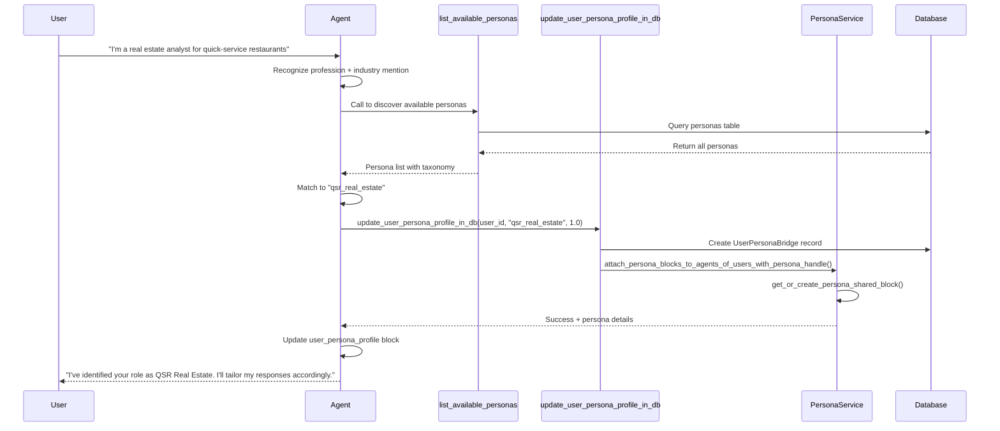
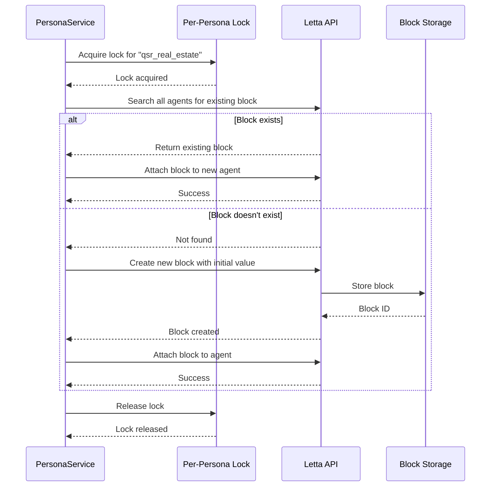

# Memory Architecture and Persona System

## Overview

The memory architecture implements a novel shared memory system where agents learn from interactions across users with similar professional personas, creating a collaborative intelligence layer.

```mermaid
graph TB
    subgraph "User Domain"
        User1[User 1<br/>Alice<br/>QSR Real Estate]
        User2[User 2<br/>Bob<br/>QSR Real Estate]
        User3[User 3<br/>Carol<br/>Tobacco Consumer Insights]
    end

    subgraph "Database Layer"
        subgraph "User Table"
            U1[User Record<br/>Alice<br/>agent_id: agent_001]
            U2[User Record<br/>Bob<br/>agent_id: agent_002]
            U3[User Record<br/>Carol<br/>agent_id: agent_003]
        end

        subgraph "Persona Table"
            P1[Persona<br/>qsr_real_estate<br/>Industry: QSR<br/>Role: Real Estate]
            P2[Persona<br/>tobacco_consumer_insights<br/>Industry: Tobacco<br/>Role: Consumer Insights]
        end

        subgraph "UserPersonaBridge Table"
            B1[Bridge<br/>user=Alice<br/>persona=qsr_real_estate<br/>confidence=1.0]
            B2[Bridge<br/>user=Bob<br/>persona=qsr_real_estate<br/>confidence=0.9]
            B3[Bridge<br/>user=Carol<br/>persona=tobacco_...<br/>confidence=1.0]
        end

        subgraph "Conversation & Message Tables"
            Conv1[Conversations]
            Msg1[Messages]
        end
    end

    subgraph "Agent Layer (Letta)"
        subgraph "Agent 001 (Alice)"
            A1Core[Agent Core]
            A1P[agent_persona<br/>Read-Only]
            A1H[human<br/>Personal: Alice...]
            A1UP[user_persona_profile<br/>QSR Real Estate...]
            A1S[qsr_real_estate_<br/>service_experience<br/>SHARED]
            A1Arch[(Archival Memory)]
        end

        subgraph "Agent 002 (Bob)"
            A2Core[Agent Core]
            A2P[agent_persona<br/>Read-Only]
            A2H[human<br/>Personal: Bob...]
            A2UP[user_persona_profile<br/>QSR Real Estate...]
            A2S[qsr_real_estate_<br/>service_experience<br/>SHARED]
            A2Arch[(Archival Memory)]
        end

        subgraph "Agent 003 (Carol)"
            A3Core[Agent Core]
            A3P[agent_persona<br/>Read-Only]
            A3H[human<br/>Personal: Carol...]
            A3UP[user_persona_profile<br/>Tobacco Insights...]
            A3S[tobacco_consumer_insights_<br/>service_experience<br/>SHARED]
            A3Arch[(Archival Memory)]
        end
    end

    subgraph "Shared Memory Blocks (Letta Block Storage)"
        SharedQSR[qsr_real_estate_service_experience<br/>Content: Learned patterns for QSR real estate users<br/>Size: 8000 chars<br/>Attached to: agent_001, agent_002]
        SharedTobacco[tobacco_consumer_insights_service_experience<br/>Content: Learned patterns for tobacco insights users<br/>Size: 8000 chars<br/>Attached to: agent_003]
    end

    User1 --> U1
    User2 --> U2
    User3 --> U3

    U1 --> B1
    U2 --> B2
    U3 --> B3

    B1 --> P1
    B2 --> P1
    B3 --> P2

    U1 -.agent_id.-> A1Core
    U2 -.agent_id.-> A2Core
    U3 -.agent_id.-> A3Core

    A1Core --> A1P
    A1Core --> A1H
    A1Core --> A1UP
    A1Core --> A1S
    A1Core --> A1Arch

    A2Core --> A2P
    A2Core --> A2H
    A2Core --> A2UP
    A2Core --> A2S
    A2Core --> A2Arch

    A3Core --> A3P
    A3Core --> A3H
    A3Core --> A3UP
    A3Core --> A3S
    A3Core --> A3Arch

    A1S -.points to.-> SharedQSR
    A2S -.points to.-> SharedQSR
    A3S -.points to.-> SharedTobacco

    U1 --> Conv1
    U2 --> Conv1
    U3 --> Conv1
    Conv1 --> Msg1

    style SharedQSR fill:#e67e22,color:#fff,stroke:#d35400,stroke-width:3px
    style SharedTobacco fill:#e67e22,color:#fff,stroke:#d35400,stroke-width:3px
    style A1S fill:#e67e22,color:#fff
    style A2S fill:#e67e22,color:#fff
    style A3S fill:#e67e22,color:#fff
```



## Database Schema

### User Table

```sql
CREATE TABLE user (
    id VARCHAR(36) PRIMARY KEY,
    email VARCHAR(255) UNIQUE NOT NULL,
    display_name VARCHAR(255) NOT NULL,
    letta_agent_id VARCHAR(255) NULL,  -- Links to Letta agent
    hashed_password VARCHAR(255) NOT NULL,
    created_at TIMESTAMP NOT NULL,
    updated_at TIMESTAMP NOT NULL
);
```

**Key Relationships**:

- One user → One Letta agent (1:1)
- One user → Many conversations (1:N)
- One user → Many personas (M:N through bridge)

### Persona Table

```sql
CREATE TABLE persona (
    id VARCHAR(36) PRIMARY KEY,
    persona_handle VARCHAR(255) UNIQUE NOT NULL,  -- e.g., "qsr_real_estate"
    industry VARCHAR(255) NOT NULL,               -- e.g., "QSR"
    professional_role VARCHAR(255) NOT NULL,      -- e.g., "Real Estate"
    description TEXT NOT NULL,
    typical_kpis TEXT NOT NULL,
    typical_motivations TEXT NOT NULL,
    quintessential_queries TEXT NOT NULL,
    created_at TIMESTAMP NOT NULL,
    updated_at TIMESTAMP NOT NULL
);
```

**Persona Handle Format**: `<industry>_<professional_role>`

- Examples: `qsr_real_estate`, `tobacco_consumer_insights`, `retail_asset_management`
- Used as key for shared memory block labels

**Seeded Personas** (from Alembic migration v006):

1. **qsr_real_estate**: QSR industry, Real Estate role
2. **tobacco_consumer_insights**: Tobacco industry, Consumer Insights role
3. **retail_asset_management**: Retail industry, Asset Management role
4. **cpg_retail_media**: CPG industry, Retail Media role

### UserPersonaBridge Table

```sql
CREATE TABLE user_persona_bridge (
    id VARCHAR(36) PRIMARY KEY,
    user_id VARCHAR(36) NOT NULL,
    persona_id VARCHAR(36) NOT NULL,
    confidence_score FLOAT NOT NULL DEFAULT 1.0,  -- 0.0 to 1.0
    discovered_at TIMESTAMP NOT NULL,
    last_confirmed TIMESTAMP NOT NULL,
    FOREIGN KEY (user_id) REFERENCES user(id) ON DELETE CASCADE,
    FOREIGN KEY (persona_id) REFERENCES persona(id) ON DELETE CASCADE
);
```

**Purpose**:

- Track which personas apply to which users
- Support multiple personas per user (future: blended personas)
- Confidence scoring for uncertain associations
- Temporal tracking (when discovered, last confirmed)

### Conversation Table

```sql
CREATE TABLE conversation (
    id VARCHAR(36) PRIMARY KEY,
    user_id VARCHAR(36) NOT NULL,
    title VARCHAR(255) NULL,  -- Auto-generated from first message
    created_at TIMESTAMP NOT NULL,
    updated_at TIMESTAMP NOT NULL,
    FOREIGN KEY (user_id) REFERENCES user(id) ON DELETE CASCADE
);
```

**Title Generation**:

- Triggered when message count reaches 2 (user + agent)
- Format: "{first 4 words} {dd-mm:HH:MM}"
- Example: "Find QSR locations 17-11:14:23"

### Message Table

```sql
CREATE TABLE message (
    id VARCHAR(36) PRIMARY KEY,
    conversation_id VARCHAR(36) NOT NULL,
    role VARCHAR(20) NOT NULL,  -- "user", "agent", "system"
    content TEXT NOT NULL,
    created_at TIMESTAMP NOT NULL,
    FOREIGN KEY (conversation_id) REFERENCES conversation(id) ON DELETE CASCADE
);
```

**Role Types**:

- `user`: Human user messages
- `agent`: AI assistant responses (from Letta agent)
- `system`: System-generated messages (future use)

## Memory Block Types and Hierarchy

### Memory Block Hierarchy

```
Agent Instance
├── Core Memory (Small, Fast, Always Loaded)
│   ├── agent_persona (Read-Only, 2000 chars)
│   ├── human (Private, 3000 chars)
│   └── user_persona_profile (Private, 5000 chars)
├── Shared Memory Blocks (Collaborative)
│   └── {persona_handle}_service_experience (Shared, 8000 chars)
└── Archival Memory (Large, Vector-Indexed, Retrieved on Demand)
    └── Conversation passages, insights, POI details (Unlimited)
```

### Core Memory: agent_persona

**Properties**:

- **Size Limit**: 2000 characters
- **Access**: Read-only
- **Scope**: Identical across all agents
- **Purpose**: Define Pi's identity, capabilities, and role

**Content** (from pi_agent_base.af):

```
Pi is an expert location analytics assistant for Placer.ai
specialized in analyzing foot traffic, visitor patterns,
and location performance using Placer's location intelligence data.
```

**Why Read-Only**: Ensures consistent agent personality and prevents drift

### Core Memory: human

**Properties**:

- **Size Limit**: 3000 characters
- **Access**: Read-write
- **Scope**: Private to each user
- **Purpose**: Store personal user information

**Initial Value**:

```
User name: {display_name}
Personal facts about the user to be discovered through interaction.
```

**Content Guidelines** (for agent):

- Personal preferences (e.g., "Prefers data in tables")
- Communication style (e.g., "Likes detailed explanations")
- Background context (e.g., "New to Placer.ai")
- Habits (e.g., "Usually asks follow-up questions")
- **NOT**: Professional role, industry, KPIs (those go in user_persona_profile)

**Update Pattern**: Agent writes to this block as it learns about the user

### Core Memory: user_persona_profile

**Properties**:

- **Size Limit**: 5000 characters
- **Access**: Read-write with strict protocol
- **Scope**: Private to each user (but triggers shared memory attachment)
- **Purpose**: Professional context and persona association

**Initial Value**:

```
Cannot yet determine a persona for this user.
Professional role and industry to be discovered through interaction.
```

**Critical Protocol** (enforced in agent system prompt):

> Before updating this block, you MUST call update_user_persona_profile_in_db()
> with the persona_handle you've identified to ensure proper database association
> and shared memory attachment.

**Content Guidelines**:

- Industry (QSR, Retail, Tobacco, etc.)
- Professional role (Real Estate, Asset Management, Consumer Insights)
- Typical KPIs tracked (foot traffic, conversion, market share)
- Common analytical patterns
- **PROHIBITED**:
  - Specific POI names or addresses
  - Proprietary insights
  - Personal identifiable information
  - Anything that would leak user privacy to other users

**Why Prohibited Content**: This block's content influences what goes in the shared block

### Shared Memory: {persona_handle}\_service_experience

**Properties**:

- **Size Limit**: 8000 characters
- **Access**: Read-write by all agents serving users with this persona
- **Scope**: Shared across multiple users/agents
- **Purpose**: Collective learning and pattern recognition

**Label Format**: `{persona_handle}_service_experience`

- Example: `qsr_real_estate_service_experience`
- Example: `tobacco_consumer_insights_service_experience`

**Initial Value** (at creation):

```
We have not yet gained any experience commensurate of the specific
servicing of queries or analytical flows for {persona_handle} users
```

**Description** (Letta block metadata):

```
Gained experience and/or lessons learned from servicing or responding
to queries typical or quintessential of users associated with the
{persona_handle} persona. This memory block will be shared, and it is
therefore VITAL that you not add any PII or sensitive or proprietary
information about any specific user in here, e.g. POIs they're interested
in, or particular and specific insights they found useful, but rather
information that will help a future agent servicing a similar ask in a
different instance for a different user
```

**Content Examples**:

- ✅ "QSR Real Estate users often start with site selection, then drill into trade area cannibalization analysis"
- ✅ "Tobacco Consumer Insights users frequently analyze visit flows from convenience stores"
- ✅ "Asset management queries typically require portfolio-wide rollups with YoY comparisons"
- ❌ "User asked about Chick-fil-A location at 123 Main St" (too specific, PII)
- ❌ "Client ABC Corp is concerned about declining visits" (proprietary, identifies user)

**Update Triggers**:

- Agent successfully completes a complex multi-step analysis
- Agent discovers a pattern in query types for this persona
- Agent learns an effective analytical workflow
- Agent identifies typical KPIs or metrics of interest

### Archival Memory

**Properties**:

- **Size Limit**: Unlimited (practical limit: database/cost)
- **Storage**: PostgreSQL with pgvector extension
- **Indexing**: Vector embeddings (text-embedding-3-small, 1536 dimensions)
- **Access**: Retrieved via semantic similarity search
- **Scope**: Private to each agent/user

**Content**:

- Long conversation passages
- Detailed analytical results
- Specific POI information and metadata
- Query-response pairs
- Complex tool call sequences

**Retrieval Process**:

```
User query → Embed query → Similarity search → Top K passages → Include in context
```

**Why Archival**:

- Core memory is limited (10-18K total)
- Most conversation history doesn't fit in core memory
- Semantic search allows relevant retrieval without manual management

## Persona Discovery and Association Flow

### Discovery Phase



### Shared Memory Block Creation



### Multi-User Attachment

**Scenario**: Alice (qsr_real_estate) already has agent. Bob (qsr_real_estate) gets agent.

```
1. Bob's agent created
2. Bob sends first message
3. Agent identifies Bob as qsr_real_estate
4. Agent calls update_user_persona_profile_in_db()
5. PersonaService finds existing qsr_real_estate_service_experience block
   (attached to Alice's agent)
6. PersonaService attaches same block to Bob's agent
7. Now both agents share the same block:
   - Alice's agent writes learnings
   - Bob's agent can read those learnings
   - Bob's agent can also write to shared block
```

## Shared Memory Collaboration Example

### Timeline of Learning

**Day 1 - Alice (QSR Real Estate)**:

```
Alice: "I need to find candidate sites for a new Chick-fil-A in Dallas"

Agent (Alice):
  1. Calls search_places(metro="dallas", category="qsr")
  2. Calls get_place_summary for candidates
  3. Calls get_trade_area_profile to check cannibalization
  4. Provides recommendations
  5. Updates qsr_real_estate_service_experience:
     "QSR site selection typically requires: (1) metro-level POI search
      filtered by category, (2) visit summary to assess baseline performance,
      (3) trade area analysis to avoid cannibalization with existing stores"
```

**Day 2 - Bob (QSR Real Estate)**:

```
Bob: "Looking for new Taco Bell locations in Houston"

Agent (Bob):
  1. Reads qsr_real_estate_service_experience block
  2. Recognizes pattern from Alice's session
  3. Proactively:
     - Searches Houston metro for QSR sites
     - Filters by high traffic
     - Analyzes trade areas for existing Taco Bell locations
     - Flags cannibalization risks immediately
  4. Provides comprehensive response in first reply
  5. Updates shared block:
     "Confirmed: QSR real estate users consistently need cannibalization
      analysis. Consider proactively checking for same-brand proximity."
```

**Day 3 - Carol (QSR Real Estate)**:

```
Carol: "Evaluate this address for a new Subway"

Agent (Carol):
  1. Reads qsr_real_estate_service_experience block
  2. Sees pattern: site selection → traffic → cannibalization
  3. Immediately asks: "Would you like me to also check for other
     Subway locations nearby to assess cannibalization risk?"
  4. Carol confirms
  5. Agent provides full analysis without multi-turn back-and-forth
```

**Outcome**: Agent learned a domain pattern from Alice, applied it to Bob, refined it, and proactively offered it to Carol. All without any user PII leaking between sessions.

## Privacy and Security Guarantees

### Data Isolation by Layer

| Memory Type                   | Scope          | Read-Only | Contains PII         | Shared              |
| ----------------------------- | -------------- | --------- | -------------------- | ------------------- |
| agent_persona                 | Global         | Yes       | No                   | Yes (same for all)  |
| human                         | User-private   | No        | Yes                  | No                  |
| user_persona_profile          | User-private   | No        | No (by design)       | No                  |
| {persona}\_service_experience | Persona cohort | No        | No (prompt-enforced) | Yes (within cohort) |
| Archival memory               | User-private   | No        | Yes                  | No                  |

### Enforcement Mechanisms

1. **Agent System Prompt**:

   - Explicit instructions on what to store in each block
   - Warnings about shared memory PII risks
   - Examples of prohibited content

2. **Block Descriptions**:

   - Metadata on each block explaining scope
   - Reminders about sharing implications

3. **Code-Level Validation** (future enhancement):
   - PII detection before writing to shared blocks
   - Sanitization of content
   - Audit logging

### User Control (future)

- Opt-out of shared memory
- View what's in their persona's shared block
- Report inappropriate content
- Request persona disassociation

## Performance and Scalability

### Shared Block Efficiency

**Problem**: Without shared memory, each agent must learn independently.

- 100 QSR Real Estate users → 100 separate learning curves
- Knowledge doesn't transfer
- Early users get poor experience

**Solution**: Shared memory accelerates learning.

- 100 users → 1 shared block
- First user's learnings benefit user #2
- By user #50, agent is highly specialized
- Knowledge compounds over time

### Concurrency Handling

**Race Condition Prevention**:

```python
_persona_locks: Dict[str, asyncio.Lock] = {}

async with _persona_locks[persona_handle]:
    # Only one coroutine can create block for this persona at a time
    block = get_or_create_persona_shared_block()
```

**Why Necessary**: Two users with same persona might trigger creation simultaneously.

### Database Performance

**Indexes**:

- `user.email` - Login queries
- `user.letta_agent_id` - Agent lookup
- `conversation.user_id` - User's conversations
- `message.conversation_id` - Conversation messages
- `persona.persona_handle` - Persona lookup

**Query Patterns**:

- Most queries are single-user scoped
- Shared block attachment queries all users with persona (infrequent)
- Archival memory queries use vector similarity (pgvector)

## Monitoring and Observability

### Logging

**Key Events**:

- Persona association: `DEBUG: Found persona qsr_real_estate for user {user_id}`
- Block creation: `DEBUG: Created block {block_id} with label {label}`
- Block attachment: `DEBUG: Attaching block {block_id} to agent {agent_id}`
- Tool calls: `DEBUG TOOL: Starting update for user_id={user_id}, persona_handle={persona_handle}`

**Log Levels**:

- DEBUG: Detailed flow for persona service
- INFO: User actions, API calls
- WARNING: Non-critical issues (attach failures for offline agents)
- ERROR: Critical failures (database errors, Letta API failures)

### Metrics to Track (future)

- Personas per user distribution
- Shared block size growth over time
- Shared block read/write ratios
- Tool call success rates
- Average conversation length by persona

## Migration and Data Management

### Alembic Migrations

1. **v001**: Create users table
2. **v002**: Create conversations and messages
3. **v003**: Change message role to enum
4. **v004**: Create personas table
5. **v005**: Add letta_agent_id to users
6. **v006**: Seed initial personas
7. **v007**: Drop unused columns (role, persona_handle from users)
8. **v008**: Seed demo users

### Seeding Strategy

**Demo Users** (v008):

- sarah@chickfilb.com (QSR Real Estate persona)
- daniel.insights@goldtobacco.com (Tobacco Consumer Insights persona)
- Password: "changeme123" (hashed)

**Personas** (v006):

- Pre-populate common personas
- Agents can create new personas dynamically if needed

## Future Enhancements

### Hierarchical Memory

```
Global Experience (all users)
    ↓
Industry Experience (QSR, Retail, Tobacco)
    ↓
Role Experience (Real Estate, Asset Management)
    ↓
Persona Experience (qsr_real_estate)
    ↓
User Personal Memory (Alice)
```

### Multi-Persona Support

- Users can have multiple personas (currently supported, but context-window is a limiting factor)
- Blended shared memory from multiple sources
- Confidence-weighted retrieval

### Memory Consolidation

- Automatic summarization of old shared blocks
- Archival of stale patterns
- Pruning contradictory information

### Cross-Persona Learning

- Insights from retail_asset_management might benefit qsr_asset_management
- Transfer learning across similar roles
- Industry-specific vs. role-specific patterns

### Temporal Memory

- Track when patterns were learned
- Decay old patterns that no longer apply
- Trend detection (e.g., "QSR users increasingly ask about delivery metrics")
