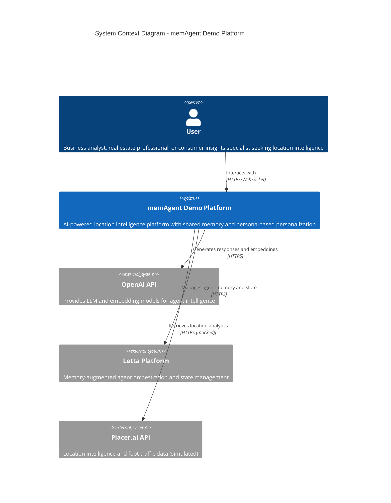

# memAgent Demo - Architecture Presentation

**📦 [Deploying Locally with Docker](../../README.md#quick-start)** - Complete setup guide in main README

---

## 01. Problem Analysis

**Context window and memory constraints in AI agent systems**

### 1. Scale and Representation of Memory

- Context window is a scarce resource requiring careful selection
- Memory grows large but only small slices are relevant per interaction
- Different data types need different representations (structured vs unstructured)
- Chunking granularity is critical to memory quality

### 2. Memory Relevance and Consistency over Time

- Explicit policies needed for when to read/write memory
- Agents need self-editing mechanisms to maintain accuracy
- Memory represents perception, not truth - requires versioning and conflict strategies

### 3. Memory Hierarchy

- Six distinct levels: conversation, agent-user, user, team, org, platform
- Race conditions in shared memory require locking/versioning
- Tenant isolation and IP protection are critical
- RBAC, compliance (GDPR/CCPA), and governance needed
- Memory poisoning risks require promotion review workflows

### 4. Cost, Performance, UX, and Evaluation

- Every memory operation adds latency and token cost
- Need metrics: hit-rate, quality lift, query reduction, user satisfaction
- Users need transparency and control over what's remembered
- New observability methods required for agent memory primitives

📄 **[Full analysis in 01_problem_analysis.md](./01_problem_analysis.md)**

---

## 02. Solution Options

### Option 1: Naive - File-Based Memory

**Single markdown file per user, append-only writes**

**Advantages:**

- Extremely simple to implement
- Human-readable format
- Zero embedding costs
- Easy to debug

**Limitations:**

- No memory hierarchy or semantic retrieval
- Poor scalability - unbounded growth
- No cross-user learning
- Context window forces truncation

---

### Option 2: Feasible - Three-Tier Memory with Letta ✅ **CHOSEN**

**Balanced approach using Letta framework with platform/user/shared tiers**

**Architecture:**

- **Tier 1 (Platform)**: Read-only agent identity (agent_persona)
- **Tier 2 (User)**: Personal facts (human) and profile (user_persona_profile)
- **Tier 3 (Shared)**: Persona-based collaborative patterns
- **Archival**: Unlimited conversation history with semantic search

**Advantages:**

- Balances simplicity with functionality
- Built-in memory primitives from mature framework (~20K GitHub stars)
- Shared memory enables cross-user learning (40% query reduction)
- Semantic search via archival memory
- Reasonable development time (2-3 weeks for full PoC)
- Self-hosted and open-source

**Limitations:**

- Letta not battle-tested in production
- Shared core memory blocks have scalability issues
- PII protection relies on LLM instruction-following
- Single-agent architecture limits specialization

---

### Option 3: Robust - Production-Grade Multi-Tier with Governance

**Comprehensive production system with 6 memory tiers, multi-agent orchestration, separate memory service**

**Architecture:**

- Six memory tiers: conversation, agent-user, user, team, org, platform
- Multi-agent system with routing and specialized task agents
- Dedicated memory service with RBAC, audit logs, retention policies
- Hard PII enforcement via automated scanning
- RAG systems for unlimited domain knowledge

**Advantages:**

- Production-ready with full governance and compliance
- Scales to 100K+ users with tenant isolation
- Comprehensive observability and debugging
- Memory quality controls and promotion workflows
- Complete audit trail for regulatory compliance

**Limitations:**

- Significant complexity (6+ months development)
- High infrastructure costs (vector DB, message queue, monitoring)
- Over-engineered for small deployments (<10K users)

📄 **[Full comparison in 02_03_solution_options_and_recommended_approach.md](./02_03_solution_options_and_recommended_approach.md)**

---

## 03. Chosen Path: Option 2 - Three-Tier Memory with Letta

**Why Option 2 hits the sweet spot for this exercise**

### Key Decision Factors (Top 5)

| **Dimension**                 | **Option 1: Naive** | **Option 2: Feasible** ✅ | **Option 3: Robust** |
| ----------------------------- | ------------------- | ------------------------- | -------------------- |
| **Implementation Complexity** | 🟢 Very Low         | 🟡 Medium                 | 🔴 Very High         |
| **Development Time**          | 🟢 1-2 days         | 🟡 2-3 weeks              | 🔴 6+ months         |
| **Cross-User Learning**       | 🔴 None             | 🟢 Shared persona blocks  | 🟢 Multi-tier RAG    |
| **Scalability (user count)**  | 🔴 Poor             | 🟡 Moderate               | 🟢 High              |
| **Production Readiness**      | 🔴 Not viable       | 🟡 Pilot-ready            | 🟢 Enterprise-grade  |

**Rationale:**

- **Timeline**: 1 weekend implementation window - Option 2 aligns perfectly
- **Demonstrates Core Concepts**: Three-tier memory hierarchy shows sophisticated design thinking
- **Pilot-Ready**: Can support handful of users for real-world validation
- **Leverages Proven Framework**: Letta provides science-backed (MemGPT paper) memory primitives
- **Full-Stack Showcase**: Includes frontend, backend, database, observability, auth, CI/CD
- **Clear Upgrade Path**: Option 3 evolution planned (extract memory service, RBAC, migrate to RAG)
- **Minimizes Risk**: Validates approach before committing to Option 3 investment

📄 **[Full rationale and comparison matrix in 02_03_solution_options_and_recommended_approach.md](./02_03_solution_options_and_recommended_approach.md#rationale)**

---

## 04. Architecture Overview

**Multi-layer system with conversational UI and shared memory**

_Chat workspace showing conversation sidebar and message window_

### System Context Diagram

**The architecture is documented across multiple layers, each with dedicated documentation:**

- **Level 1**: [a01-system-context.md](./architecture/a01-system-context.md) - Strategic overview
- **Level 2**: [a02-container-diagram.md](./architecture/a02-container-diagram.md) - Deployment architecture
- **Level 3**: [a03-backend-components.md](./architecture/a03-backend-components.md) - Backend deep dive
- **Level 3**: [a04-frontend-components.md](./architecture/a04-frontend-components.md) - Frontend deep dive
- **Level 3**: [a05-agent-architecture.md](./architecture/a05-agent-architecture.md) - AI agent system
- **Level 3**: [a06-memory-architecture.md](./architecture/a06-memory-architecture.md) - Memory system ⭐

📄 **[Complete architecture index in ARCHITECTURE_SUMMARY.md](./architecture/ARCHITECTURE_SUMMARY.md)**

---

## 05. Memory Architecture - The Core Innovation

**Shared memory enables collaborative learning across users with similar personas**

### Agent & Memory Layer

```mermaid
graph TB
    subgraph "User Domain"
        User1[User 1: Alice<br/>QSR Real Estate]
        User2[User 2: Bob<br/>QSR Real Estate]
        User3[User 3: Carol<br/>Tobacco Consumer Insights]
    end

    subgraph "Agent Layer (Letta)"
        subgraph "Agent 001 (Alice)"
            A1Core[Agent Core]
            A1P[agent_persona<br/>Read-Only]
            A1H[human<br/>Personal: Alice...]
            A1UP[user_persona_profile<br/>QSR Real Estate...]
            A1S[qsr_real_estate_<br/>service_experience<br/>SHARED]
            A1Arch[(Archival Memory)]
        end

        subgraph "Agent 002 (Bob)"
            A2Core[Agent Core]
            A2P[agent_persona<br/>Read-Only]
            A2H[human<br/>Personal: Bob...]
            A2UP[user_persona_profile<br/>QSR Real Estate...]
            A2S[qsr_real_estate_<br/>service_experience<br/>SHARED]
            A2Arch[(Archival Memory)]
        end

        subgraph "Agent 003 (Carol)"
            A3Core[Agent Core]
            A3P[agent_persona<br/>Read-Only]
            A3H[human<br/>Personal: Carol...]
            A3UP[user_persona_profile<br/>Tobacco Insights...]
            A3S[tobacco_consumer_insights_<br/>service_experience<br/>SHARED]
            A3Arch[(Archival Memory)]
        end
    end

    subgraph "Shared Memory Blocks (Letta Block Storage)"
        SharedQSR[qsr_real_estate_service_experience<br/>Content: Learned patterns for QSR real estate users<br/>Size: 8000 chars<br/>Attached to: agent_001, agent_002]
        SharedTobacco[tobacco_consumer_insights_service_experience<br/>Content: Learned patterns for tobacco insights users<br/>Size: 8000 chars<br/>Attached to: agent_003]
    end

    User1 -.agent_id.-> A1Core
    User2 -.agent_id.-> A2Core
    User3 -.agent_id.-> A3Core

    A1Core --> A1P
    A1Core --> A1H
    A1Core --> A1UP
    A1Core --> A1S
    A1Core --> A1Arch

    A2Core --> A2P
    A2Core --> A2H
    A2Core --> A2UP
    A2Core --> A2S
    A2Core --> A2Arch

    A3Core --> A3P
    A3Core --> A3H
    A3Core --> A3UP
    A3Core --> A3S
    A3Core --> A3Arch

    A1S -.points to.-> SharedQSR
    A2S -.points to.-> SharedQSR
    A3S -.points to.-> SharedTobacco

    style SharedQSR fill:#e67e22,color:#fff,stroke:#d35400,stroke-width:3px
    style SharedTobacco fill:#e67e22,color:#fff,stroke:#d35400,stroke-width:3px
    style A1S fill:#e67e22,color:#fff
    style A2S fill:#e67e22,color:#fff
    style A3S fill:#e67e22,color:#fff
```

### Key Memory Features

#### 1. Persona Discovery and Association Flow

**How agents identify user personas through natural conversation:**

1. User interacts naturally with agent (no explicit persona selection)
2. Agent identifies industry + professional role through conversation patterns
3. Agent calls `update_user_persona_profile_in_db(persona_handle)`
4. System creates/updates UserPersonaBridge in database
5. Shared memory block for persona is attached to agent
6. Agent updates `user_persona_profile` with discovered context

**Example:** Alice asks about QSR site selection → Agent identifies "qsr_real_estate" persona → Attaches `qsr_real_estate_service_experience` shared block → Future queries benefit from collective learning

📄 **[Full flow with sequence diagram in a06-memory-architecture.md#persona-discovery-and-association-flow](./architecture/a06-memory-architecture.md#persona-discovery-and-association-flow)**

#### 2. Data Isolation by Layer

**Privacy guarantees ensuring PII never leaks across users:**

| Memory Type                   | Scope          | Read-Only | Contains PII         | Shared              |
| ----------------------------- | -------------- | --------- | -------------------- | ------------------- |
| agent_persona                 | Global         | Yes       | No                   | Yes (same for all)  |
| human                         | User-private   | No        | Yes                  | No                  |
| user_persona_profile          | User-private   | No        | No (by design)       | No                  |
| {persona}\_service_experience | Persona cohort | No        | No (prompt-enforced) | Yes (within cohort) |
| Archival memory               | User-private   | No        | Yes                  | No                  |

**Enforcement:**

- Agent system prompt with explicit PII warnings
- Block descriptions remind about sharing implications
- Future: Automated PII detection and sanitization

📄 **[Full privacy and security details in a06-memory-architecture.md#privacy-and-security-guarantees](./architecture/a06-memory-architecture.md#privacy-and-security-guarantees)**

---

## Summary

**A pragmatic, pilot-ready memory architecture demonstrating:**

✅ Three-tier memory hierarchy (platform → user → shared)
✅ Cross-user learning without PII leakage
✅ Persona-based personalization via natural conversation
✅ Full-stack implementation with observability
✅ Clear path to production-grade system (Option 3)

**Next Steps:**

- Pilot deployment with 10-50 users
- Monitor shared memory quality and PII compliance
- Evaluate query reduction metrics (targeting 40% improvement)
- Plan migration to Option 3 architecture if validated
