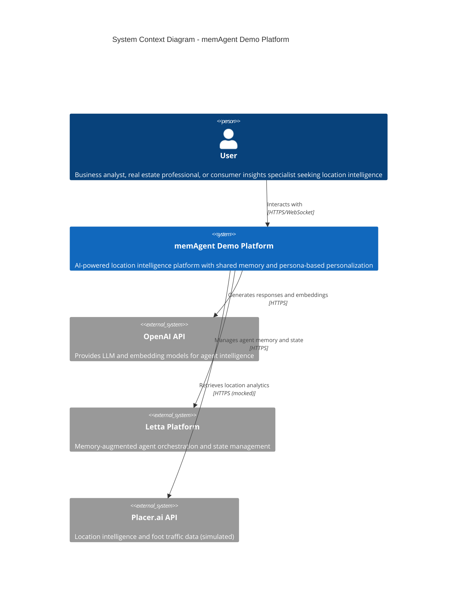

# System Context Diagram (Level 1)

## Overview

The memAgent Demo system is a location intelligence platform that combines conversational AI with location analytics capabilities, providing users with personalized insights through an AI assistant named "Pi".

## System Purpose

The memAgent Demo platform demonstrates a novel approach to AI-powered analytics where:

- **Shared Memory**: Agents learn from interactions across users with similar personas
- **Persona-Based Personalization**: Industry/role combinations drive tailored responses
- **Location Intelligence**: Integration with Placer.ai-style analytics for foot traffic and POI data
- **Continuous Learning**: Experiences are captured in shared memory blocks to improve future interactions

## Key External Dependencies

### OpenAI API

- **Purpose**: Provides LLM (GPT-4o) and embedding models (text-embedding-3-small)
- **Usage**: Powers agent reasoning, natural language understanding, and vector embeddings
- **Configuration**: Configurable via environment variables

### Letta Platform

- **Purpose**: Memory-augmented agent framework for stateful conversations
- **Usage**: Manages agent lifecycle, memory blocks, and tool execution
- **Architecture**: Self-hosted container in the deployment
- **Database**: Shares PostgreSQL with main application for vector storage

### Placer.ai API (Simulated)

- **Purpose**: Location intelligence data source
- **Current State**: Mock implementation with synthetic data
- **Future Integration**: Designed for real Placer.ai API integration
- **Data Types**: POI search, visit flows, audience profiles, trade areas

## User Types

### Primary Personas

1. **Real Estate Professionals**: Site selection, comp analysis, cannibalization risk
2. **Asset Managers**: Portfolio health, tenant mix optimization, center performance
3. **Retail Media Specialists**: Store selection for campaigns, audience targeting
4. **Consumer Insights Analysts**: Behavior patterns, outlet performance, golf-to-retail flows

## Key Capabilities

- Conversational interface for location analytics
- Persona discovery and association
- Shared memory across similar user types
- Tool-based integration for location data
- Multi-conversation history
- Agent memory visualization
