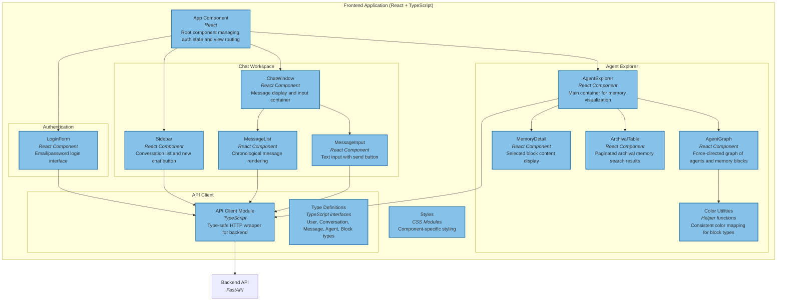

# Frontend Component Diagram (Level 3)

## Overview

The frontend is a React single-page application providing a conversational interface for location analytics and a visualization tool for agent memory inspection.

#### Chat interface for users


#### Agent Memory Explorer UI




## Component Details

### App Component

**Responsibilities**:

- Root application state management
- Authentication state (token, user)
- View routing (chat vs. agents)
- Session persistence (localStorage)
- Conversation list management

**State**:

```typescript
{
  auth: { token: string, user: User | null } | null
  loading: boolean
  error: string | null
  initializing: boolean
  conversations: Conversation[]
  currentConversationId: string | null
  activeView: "chat" | "agents"
}
```

**Effects**:

1. **Session Restoration**: On mount, restore user from token
2. **Conversation Loading**: Load when authenticated

**Key Handlers**:

- `handleLogin()` - Authenticate and store token
- `handleLogout()` - Clear state and localStorage
- `handleNewChat()` - Create conversation, select it
- `handleSelectConversation()` - Change active conversation

### LoginForm Component

**Props**:

```typescript
{
  onSubmit: (email: string, password: string) => Promise<void>;
  loading: boolean;
  error: string | null;
}
```

**Features**:

- Controlled form inputs
- Loading state (disabled during request)
- Error display
- Form validation (client-side)

### Sidebar Component

**Props**:

```typescript
{
  conversations: Conversation[]
  activeConversationId: string | null
  onSelectConversation: (id: string) => void
  onNewChat: () => void
}
```

**Features**:

- Scrollable conversation list
- Active conversation highlighting
- Display title or fallback ("New Chat")
- New chat button at top
- Timestamp formatting

### ChatWindow Component

**Props**:

```typescript
{
  user: User;
  token: string;
  conversationId: string | null;
}
```

**State**:

- `messages`: Message[]
- `inputValue`: string
- `sending`: boolean

**Effects**:

- Load messages when conversationId changes
- Auto-scroll to bottom on new messages

**Features**:

- Empty state when no conversation selected
- Message loading indicator
- Auto-refresh after sending


_Chat interface with conversation sidebar and message window_

### MessageList Component

**Props**:

```typescript
{
  messages: Message[]
  userName: string
}
```

**Features**:

- Role-based styling (user vs. agent)
- Timestamp display
- Markdown rendering (future enhancement)
- Auto-scroll container

### MessageInput Component

**Props**:

```typescript
{
  value: string
  onChange: (value: string) => void
  onSend: () => void
  disabled: boolean
}
```

**Features**:

- Text area (multiline support)
- Send button
- Enter to send (Shift+Enter for newline)
- Character limit indicator (future)

## Agent Explorer Components

### AgentExplorer (Main Container)

**State**:

- `agents`: AgentOverview[]
- `allBlocks`: MemoryBlock[]
- `selectedBlock`: MemoryBlock | null
- `archivalEntries`: ArchivalEntry[]
- `archivalQuery`: string
- `loading`: boolean

**Effects**:

- Load agents and blocks on mount
- Poll for updates (optional)

**Layout**:

```
+-----------------------------------+
| Agent Graph (left panel)          |
| - Force-directed visualization    |
| - Agent nodes (circles)           |
| - Block nodes (rectangles)        |
| - Edges (attachments)             |
+-----------------------------------+
| Memory Detail (right top)         |
| - Selected block content          |
| - Edit capability (future)        |
+-----------------------------------+
| Archival Table (right bottom)     |
| - Search input                    |
| - Paginated results               |
| - Text content display            |
+-----------------------------------+
```


_Agent memory visualization with force-directed graph showing agents, memory blocks, and their relationships_

### AgentGraph Component

**Props**:

```typescript
{
  agents: AgentOverview[]
  blocks: MemoryBlock[]
}
```

**Features**:

- Force-directed graph layout (D3-inspired, custom React implementation)
- Node types:
  - **Agent nodes**: Circles with agent name
  - **Block nodes**: Rectangles with block label
- Edge rendering: Lines connecting agents to attached blocks
- Color coding by block type:
  - `agent_persona`: Purple
  - `human`: Blue
  - `user_persona_profile`: Green
  - Persona-specific blocks: Orange
- Hover effects
- Click to select block
- Zoom and pan (future enhancement)

**Layout Algorithm**:

- Physics simulation (spring forces)
- Repulsion between nodes
- Attraction along edges
- Boundary constraints

### MemoryDetail Component

**Props**:

```typescript
{
  block: MemoryBlock | null;
}
```

**Display**:

- Block label (header)
- Block ID and metadata
- Content value (scrollable text area)
- Description
- Attached agent count
- Read-only indicator

### ArchivalTable Component

**Props**:

```typescript
{
  entries: ArchivalEntry[]
  onSearch: (query: string) => void
}
```

**Features**:

- Search input (debounced)
- Pagination (50 per page)
- Columns:
  - Content (truncated)
  - Timestamp
  - Agent ID
- Row expansion for full content
- Empty state

### Color Utilities

**Functions**:

- `getMemoryLabelColor(label: string): string` - Consistent color mapping
- `AGENT_NODE_COLOR`: Constant for agent nodes

**Color Scheme**:

- Semantic colors for standard blocks
- Hash-based colors for custom blocks (consistent across renders)

## API Client Module

### Core Functions

```typescript
// Authentication
login(email: string, password: string): Promise<LoginResponse>
signup(email: string, password: string, displayName: string): Promise<SignupResponse>
fetchCurrentUser(token: string): Promise<User>

// Conversations
getConversations(token: string): Promise<ConversationListResponse>
createConversation(token: string): Promise<CreateConversationResponse>

// Messages
getMessages(token: string, conversationId: string): Promise<MessageListResponse>
sendMessage(token: string, conversationId: string, content: string): Promise<SendMessageResponse>

// Letta/Agent Explorer
getAgents(token: string): Promise<AgentListResponse>
getBlocks(token: string, agentId: string): Promise<BlockListResponse>
getArchival(token: string, agentId: string, query?: string): Promise<ArchivalResponse>
```

### Error Handling

- HTTP error responses thrown as exceptions
- Includes status code and message
- Handled in components with try/catch
- User-friendly error display

### Type Definitions

```typescript
interface User {
  id: string;
  email: string;
  display_name: string;
  letta_agent_id: string | null;
}

interface Conversation {
  id: string;
  user_id: string;
  title: string | null;
  created_at: string;
  updated_at: string;
}

interface Message {
  id: string;
  conversation_id: string;
  role: "user" | "agent" | "system";
  content: string;
  created_at: string;
}

interface AgentOverview {
  id: string;
  name: string;
  created_at: string;
}

interface MemoryBlock {
  id: string;
  label: string;
  value: string;
  limit: number;
  description?: string;
  is_template: boolean;
}

interface ArchivalEntry {
  id: string;
  content: string;
  created_at: string;
  agent_id: string;
}
```

## State Management Patterns

### Local Component State

- `useState` for component-specific data
- `useEffect` for side effects and data loading
- No global state library (Redux, Zustand, etc.)

### Authentication State

- Stored in App component
- Passed via props to children
- Persisted to localStorage as JSON
- Restored on app initialization

### API Data Caching

- Conversations: Re-fetched after state changes
- Messages: Loaded per conversation
- Agents/Blocks: Loaded on explorer mount
- No sophisticated cache invalidation (refresh pattern)

## Styling Approach

### CSS Modules

- Component-scoped styles
- BEM-like naming conventions
- Utility classes for common patterns

### Layout

- Flexbox for most layouts
- Grid for complex multi-column layouts
- Responsive design (mobile-friendly)

### Theme

- CSS variables for colors
- Consistent spacing scale
- Typography hierarchy

## Build and Development

### Vite Configuration

- Fast HMR (Hot Module Replacement)
- TypeScript compilation
- ESLint integration
- Environment variable support (`.env` files)

### Development Server

```bash
pnpm dev --host 0.0.0.0 --port 5173
```

### Production Build

```bash
pnpm build
# Outputs to dist/
```

### Testing

- Vitest for unit tests
- React Testing Library
- Coverage: Basic component rendering tests

## Future Enhancements

### Chat Features

- Markdown rendering for messages
- Code syntax highlighting
- File attachments
- Message editing/deletion
- Typing indicators

### Agent Explorer

- Real-time updates (WebSocket)
- Memory block editing
- Agent creation UI
- Tool execution logs
- Archival memory filtering/sorting

### General

- Dark mode
- Accessibility improvements (ARIA labels)
- Internationalization (i18n)
- Progressive Web App (PWA) support
