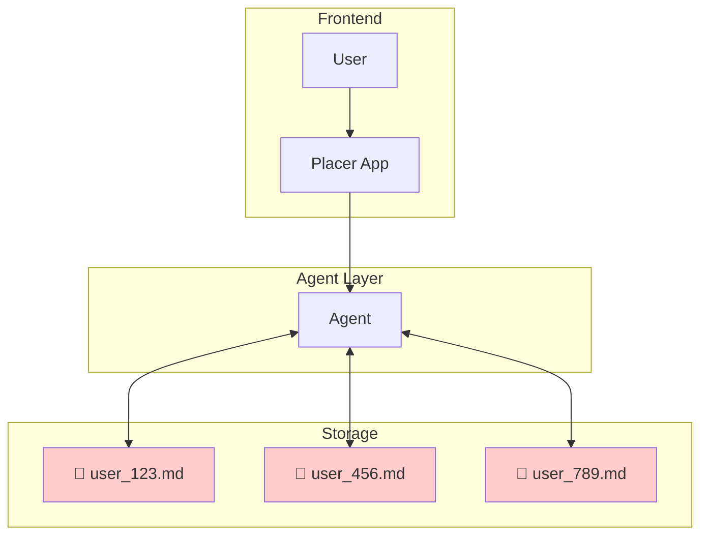
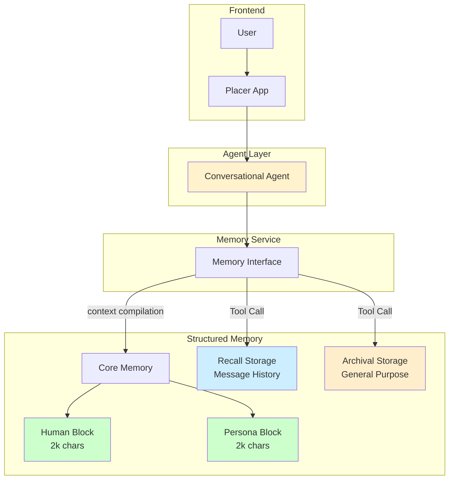
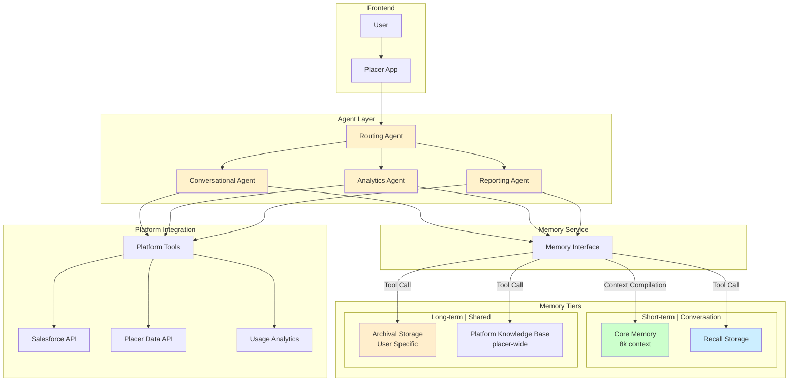
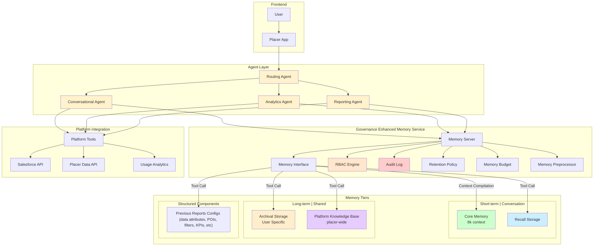

# Memory System Comparison Matrix

## Solution Definitions

- **Naive**: Simple .md document per user with unstructured read/write access
- **Basic**: User and agent memory with structured blocks
- **Enhanced**: User, agent, and platform memory integration
- **Robust**: Multi-tier with RBAC, policies, and compliance controls

## Performance Comparison

| Concern                                | Naive Memory System                                 | Basic User & Agent Memory                               | Enhanced User, Agent & Platform Memory             | Robust Multi-tier with RBAC                                                   |
| -------------------------------------- | --------------------------------------------------- | ------------------------------------------------------- | -------------------------------------------------- | ----------------------------------------------------------------------------- |
| **Short / Long-term Memory**           | 🔴 Single unstructured file per user                | 🟡 Separate short-term and long-term, but LT is simple  | 🟢 Improved LT approach, adds platform memory      | 🟢 Same as enhanced with retention & governance                               |
| **Memory Relevance (Signal vs Noise)** | 🔴 LLM judges relevance on read + write, no RAG     | 🟢 RAG/Semantic search for relevance                    | 🟢 RAG/Semantic search for relevance               | 🟢 Governance improves read/write paths                                       |
| **Representation Form**                | 🔴 Unstructured text only                           | 🟡 Mixed structured/unstructured                        | 🟢 Mixed, separated short/long term structures     | 🟢 Adds structured report configs (POIs, filters, KPIs)                       |
| **Chunking Strategy**                  | 🔴 No chunking, whole file in context               | 🟡 Fixed block sizes in core, chunk size configurable   | 🟡 Same as basic                                   | 🟢 Memory Prepossessor opens up multiple strategies                           |
| **Staleness & Versioning**             | 🔴 Timestamps are LLM-managed, difficult versioning | 🟡 Manual timestamp tracking only                       | 🟢 Auto-timestamping, basic TTLs                   | 🟢 Full versioning with "as of" queries, automated decay                      |
| **Conflicting Facts**                  | 🔴 Last write wins, contradictions invisible        | 🟡 Agent may notice conflicts, no resolution            | 🟢 Conflict detection alerts                       | 🟢 Conflict resolution policies, keep history with current truth view         |
| **Cross-chat Memory**                  | 🔴 Single file grows unbounded, no chat separation  | 🟢 Distinct short-term (recall) vs long-term (archival) | 🟢 Same as basic with platform knowledge access    | 🟢 Same as enhanced with governance                                           |
| **Cross-agent Memory**                 | 🔴 No agent isolation, shared file                  | 🟡 Agents share user memory, no agent-private state     | 🟢 Agent-private state + shared memory             | 🟢 Agent memory scopes with coordination policies                             |
| **Layered Memory Scopes**              | 🔴 Single user scope only                           | 🔴 User scope only                                      | 🟡 User + platform scopes, no team/org             | 🟢 User, team, org, platform scopes with override rules                       |
| **Tenant Isolation**                   | 🔴 File permissions only, no multi-tenancy          | 🟡 User-level isolation via Letta user_id               | 🟡 Platform knowledge shared without IP protection | 🟢 Strict multi-tenant isolation with customer IP protection                  |
| **RBAC Controls**                      | 🔴 No access controls                               | 🔴 No role concept                                      | 🟡 Basic platform vs user separation               | 🟢 Full RBAC for read/write/promote/demote at all scopes                      |
| **Regulatory Compliance (GDPR/CCPA)**  | 🔴 No data inventory, no deletion support           | 🔴 No compliance features                               | 🟡 Basic data inventory, manual deletion           | 🟢 Full compliance: discovery, deletion, audit trails                         |
| **Memory Poisoning Protection**        | 🔴 No protection, users write anything              | 🟡 Agent-mediated writes reduce risk                    | 🟡 Platform promotion uncontrolled                 | 🟢 Review workflow for platform-level promotion                               |
| **Read/Write Triggers**                | 🔴 Ad-hoc, model decides                            | 🟡 Agent has memory tools, may over/under use           | 🟢 Explicit policies for when to query/write       | 🟢 Policy engine with budgets and guardrails                                  |
| **Tool Schema Robustness**             | 🔴 No tools, raw file access                        | 🟡 Simple schemas, limited complexity                   | 🟢 Well-tested Letta schemas                       | 🟢 Validated schemas with versioning                                          |
| **Multi-agent Coordination**           | 🔴 No coordination, conflicts likely                | 🟡 Agents may clobber each other's memories             | 🟢 Agent-specific storage boundaries               | 🟢 Coordination layer prevents conflicts                                      |
| **Latency Impact**                     | 🔴 Entire file in context, high token cost          | 🟡 Context window limits, moderate cost                 | 🟡 Vector search adds latency                      | 🟢 Optimized retrieval with caching                                           |
| **Cost per Query**                     | 🟢 Minimal, just LLM tokens                         | 🟡 Moderate, embedding + LLM costs                      | 🔴 Higher, external API calls + embeddings         | 🔴 Highest, complex retrieval + governance overhead                           |
| **Memory Value Metrics**               | 🔴 No metrics, no evaluation                        | 🔴 Basic logging only                                   | 🟡 Usage tracking, manual evaluation               | 🟢 Automated metrics: hit rate, quality lift, reduction in repeated questions |
| **User Control & Transparency**        | 🔴 Users can't see what's stored                    | 🟡 Users can query memory via agent                     | 🟢 Memory inspection UI, deletion support          | 🟢 Full transparency: inspect, edit, delete with audit trail                  |
| **Creepy Personalization Risk**        | 🔴 No controls, could store anything                | 🟡 Agent filters somewhat, still risky                  | 🟡 Opt-in for sensitive data not enforced          | 🟢 Sensitivity classification with explicit consent flows                     |
| **Implementation Complexity**          | 🟢 Weekend project                                  | 🟢 1 week deployment                                    | 🟡 2-3 weeks setup                                 | 🔴 4-6 weeks minimum                                                          |
| **Debugging & Observability**          | 🔴 Grep through markdown files                      | 🟢 White-box memory visibility                          | 🟢 Tool-level monitoring                           | 🟢 Comprehensive observability with memory provenance                         |

## Legend

- 🟢 **Green**: Excellent - Fully addresses the concern
- 🟡 **Yellow**: Adequate - Partially addresses with limitations
- 🔴 **Red**: Poor - Significant gaps or issues

## Key Insights

### Naive System

- **Pros**: Dead simple, quick to prototype
- **Cons**: Scales poorly, no structure, compliance nightmare
- **Use Case**: Hackathon or proof-of-concept only

### Basic Memory

- **Pros**: Production-ready, proven architecture
- **Cons**: Limited to agent context, no platform integration
- **Use Case**: MVP or single-purpose agents

### Enhanced Memory

- **Pros**: Balances capability with complexity
- **Cons**: Requires integration work
- **Use Case**: Production deployment (RECOMMENDED)

### Robust Multi-tier

- **Pros**: Enterprise-grade with full governance
- **Cons**: High complexity and cost
- **Use Case**: Regulated industries or large enterprises

## High Level Architecture Diagrams

### Naive Memory System

### Basic User & Agent Memory

### Enhanced User, Agent & Platform Memory

### Robust Multi-tier with RBAC

## Recommendation Priority - Enhanced User, Agent & Platform Memory

For Placer Intelligence, considering the need for:

1. Quick time-to-market
2. Platform data integration (Salesforce, usage analytics)
3. Scalability for growth
4. Reasonable compliance needs

## Implementation Plan

For the purpose of this exercise, we will focus on implementing the "Enhanced User, Agent & Platform Memory" solution with some 'shortcuts' as this is meant to assess the author's technical abilities, not actually deploy the solution. The implementation plan will include the following steps:
