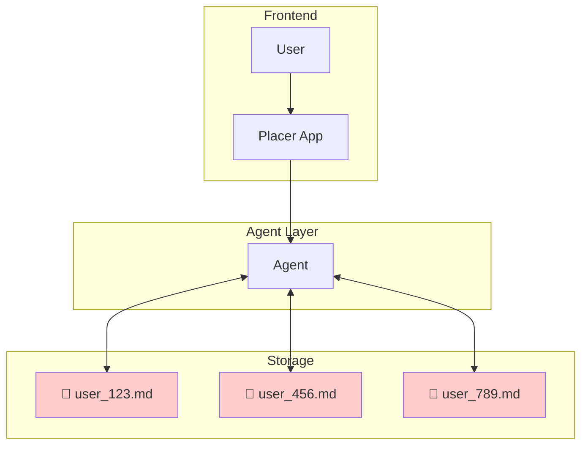
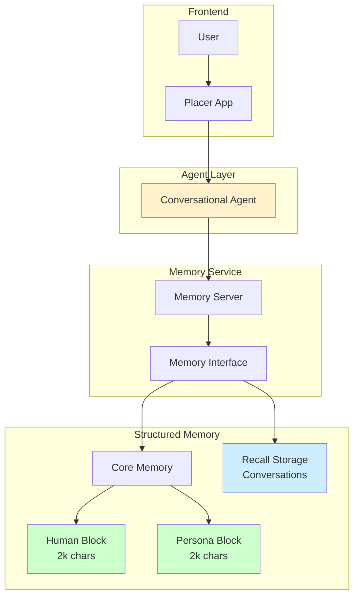
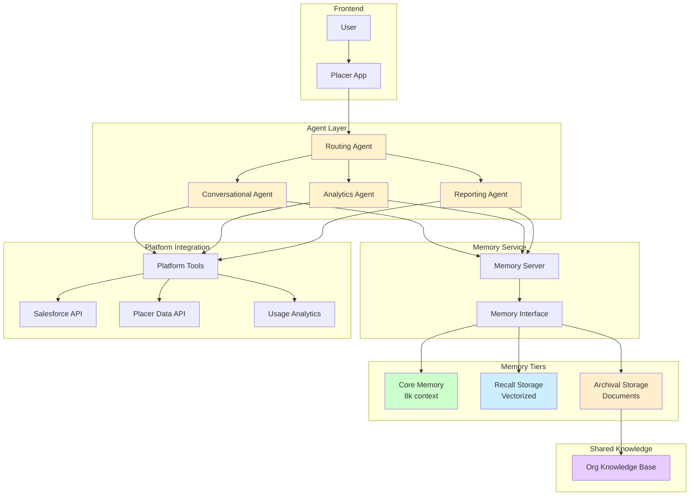
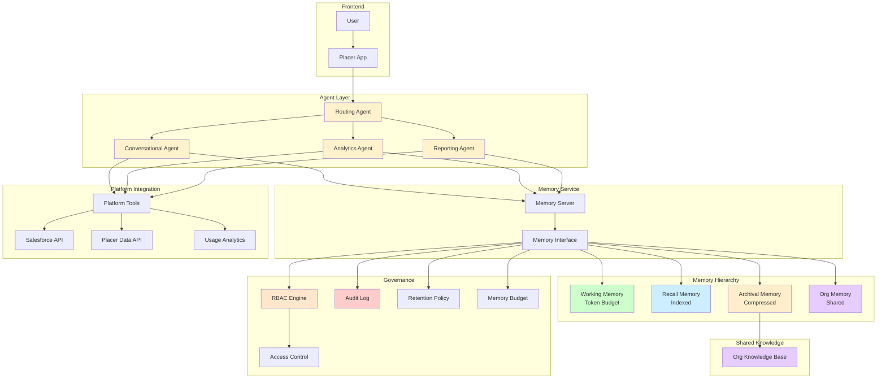

# Memory System Comparison Matrix

## Solution Definitions
- **Naive**: Simple .md document per user with unstructured read/write access
- **Basic**: User and agent memory with structured blocks
- **Enhanced**: User, agent, and platform memory integration  
- **Robust**: Multi-tier with RBAC, policies, and compliance controls

## Performance Comparison

| Concern | Naive Memory System | Basic User & Agent Memory | Enhanced User, Agent & Platform Memory | Robust Multi-tier with RBAC |
|---------|-------------------|-------------------------|------------------------------|----------------------------|
| **Personalization Depth** | 🔴 Shallow, unstructured text dump | 🟡 Structured user blocks, limited depth | 🟢 Rich context from multiple sources | 🟢 Deep multi-dimensional personalization |
| **Cross-session Continuity** | 🟡 Persists but hard to query | 🟢 Automatic session persistence | 🟢 Full continuity with context | 🟢 Complete history with governance |
| **Scalability** | 🔴 Files grow unbounded, slow searches | 🟡 Per-user agents limit scale | 🟢 Shared tools reduce redundancy | 🟢 Distributed with resource optimization |
| **Data Structure** | 🔴 Unstructured text only | 🟡 Basic structured blocks | 🟢 Mixed structured/unstructured | 🟢 Schema-driven with validation |
| **Query Performance** | 🔴 Linear search through text | 🟡 In-memory but limited recall | 🟢 Vector search with caching | 🟢 Optimized multi-tier retrieval |
| **Data Freshness** | 🔴 No automatic updates | 🟡 Manual memory updates only | 🟢 Platform data auto-synced | 🟢 Real-time with change detection |
| **Context Relevance** | 🔴 No relevance scoring | 🟡 Basic recency weighting | 🟢 Semantic similarity ranking | 🟢 ML-driven relevance optimization |
| **Memory Conflicts** | 🔴 Last write wins, data loss | 🟡 Agent-managed deduplication | 🟢 Conflict detection and merge | 🟢 Version control with policies |
| **Privacy & Compliance** | 🔴 No access controls | 🔴 Basic user isolation only | 🟡 Platform-level controls | 🟢 Full RBAC and audit trails |
| **Cost Efficiency** | 🟢 Minimal infrastructure needed | 🟡 Moderate compute and storage | 🟡 Higher with external calls | 🔴 Significant infrastructure investment |
| **Implementation Complexity** | 🟢 Weekend project | 🟢 1 week deployment | 🟡 2-3 weeks setup | 🔴 4-6 weeks minimum |
| **Debugging & Observability** | 🔴 Grep through markdown files | 🟢 White-box memory visibility | 🟢 Tool-level monitoring | 🟡 Complex but comprehensive |
| **Knowledge Sharing** | 🔴 No org-level sharing | 🔴 Isolated per user | 🟡 Limited platform sharing | 🟢 Full organizational knowledge graph |
| **Proactive Assistance** | 🔴 No pattern recognition | 🔴 Reactive only | 🟡 Basic pattern detection | 🟢 Predictive with recommendations |
| **Multi-source Integration** | 🔴 Manual copy-paste only | 🔴 Agent memory only | 🟢 Salesforce, usage integrated | 🟢 Unlimited source connectivity |
| **Memory Management** | 🔴 Manual cleanup needed | 🟢 Auto-compression built-in | 🟢 Smart summarization | 🟢 Policy-driven lifecycle |
| **Error Recovery** | 🔴 Corrupted files unrecoverable | 🟡 Session recovery only | 🟢 Checkpoint restoration | 🟢 Full disaster recovery |
| **Access Control** | 🔴 File permissions only | 🔴 User-level only | 🟡 Basic role separation | 🟢 Granular RBAC policies |
| **Audit & Compliance** | 🔴 No audit trail | 🔴 Basic logging only | 🟡 API-level logging | 🟢 Complete audit with retention |
| **Memory Budgets** | 🔴 Uncontrolled growth | 🟡 Fixed character limits | 🟡 Configurable limits | 🟢 Dynamic budget allocation |
| **Data Retention** | 🔴 Never expires | 🟡 Simple time-based | 🟢 Smart archival | 🟢 Policy-driven retention |

## Legend
- 🟢 **Green**: Excellent - Fully addresses the concern
- 🟡 **Yellow**: Adequate - Partially addresses with limitations
- 🔴 **Red**: Poor - Significant gaps or issues

## Key Insights

### Naive System
- **Pros**: Dead simple, quick to prototype
- **Cons**: Scales poorly, no structure, compliance nightmare
- **Use Case**: Hackathon or proof-of-concept only

### Basic Memory
- **Pros**: Production-ready, proven architecture
- **Cons**: Limited to agent context, no platform integration
- **Use Case**: MVP or single-purpose agents

### Enhanced Memory
- **Pros**: Balances capability with complexity
- **Cons**: Requires integration work
- **Use Case**: Production deployment (RECOMMENDED)

### Robust Multi-tier
- **Pros**: Enterprise-grade with full governance
- **Cons**: High complexity and cost
- **Use Case**: Regulated industries or large enterprises

## High Level Architecture Diagrams

### Naive Memory System

### Basic User & Agent Memory

### Enhanced User, Agent & Platform Memory

### Robust Multi-tier with RBAC

## Recommendation Priority - Enhanced User, Agent & Platform Memory

For Placer Intelligence, considering the need for:
1. Quick time-to-market
2. Platform data integration (Salesforce, usage analytics)
3. Scalability for growth
4. Reasonable compliance needs

## Implementation Plan
For the purpose of this exercise, we will focus on implementing the "Enhanced User, Agent & Platform Memory" solution with some 'shortcuts' as this is meant to assess the author's technical abilities, not actually deploy the solution. The implementation plan will include the following steps: